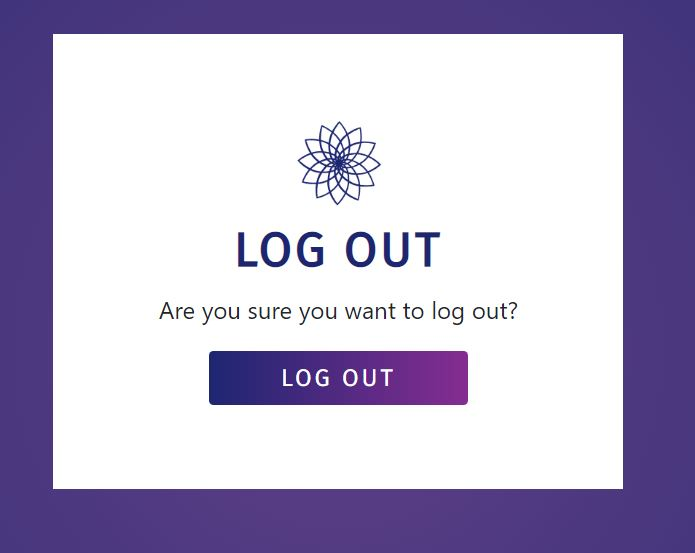

# KOR CBD e-Commerce Store


The KOR CBD e-Commerce store is for a company which sells CBD products to athletes, and is particularly targeted towards martial artists. It is designed to 
allow users to shop and checkout either anonymously or as a logged in user using Stripe's Payment appearing. Extra features are available to logged in users, such as persiting their user
profile information, a saved order history, and the ability to interact with blog posts. The whole app is written in Python using the Django framework. 

The django app is deployed using Amazon Web Services and Heroku and is availabe here [KOR CBD](https://korcbd.herokuapp.com/).


## Contents
1. [Client](#client)
    - [Client Information](#client-information)
2. [UX](#ux)
    - [Users](#users)
    - [User Goals](#user-goals)
    - [Wireframes](#wireframes)
    - [Colour Palette](#colour-palette)
3. [Features](#features)
     - [Navigation](#navigation)
     - [Home](#home)
     - [Allauth](#allauth)
     - [About](#about)
     - [Products](#products)
     - [Cart](#cart)
     - [Checkout](#checkout)
     - [Profiles](#profiles)
     - [Blog](#blog)
     - [404](#404)
     - [Toasts](#toasts)
     - [Future Features](#future-features)
4. [Information Architecture](#information-architecture)
    - [Database](#database)
    - [Data Models](#data-models)
5. [Technologies Used](#technologies-used)
    - [Frameworks](#frameworks)
    - [Template Engines](#template-engines)
    - [Databases](#databases)
    - [Hosting](#hosting)
    - [APIs](#APIs)
    - [Python Packages](#python-packages)
    - [Front-End Libraries](#frontend-libraries)
    - [Languages](#languages)
    - [Development Tools](#development-tools)
    - [Testing Tools](#testing-tools)
    - [Content](#content)
6. [Testing](#testing-tools)
7. [Deployment](#deployment)
    - [Requirements](#requirements)
    - [Git Instructions](#git-instructions)
    - [Heroku Instructions](#heroku-instructions)
8. [Credits](#credits)
    - [Content and Code](#content-and-code)
    - [Media](#media)
    - [Acknowledgements](#acknowledgements)


## Client Information

The goals that KOR CBD have given for this e-Commerce store are: 

- Present a clinical and reputable brand aesthetic without appearing bland. 
- Target the website to martial artists, without using jargon that excludes athletes from other sports. 
- Have a smooth payment flow for customers from the moment a project is added to the cart.
- Provide a record of all orders placed so that they can be fulfilled. 
- Provide customers with extra information about the company through an about page and a blog. 
- Restrict certain activities to KORCBD staff such as CRUD functionality for products and blog posts.
- Link the store to the companies social media accounts to bootst customer interaction. 

## UX

### Users

Users of the KOR CBD website are most likely looking to buy CBD products. While the company targets itself at martial artists, many of their customers are athletes in other sports. The website needs to still be accessible to them. 

## User Goals 

- As a user I want to be able to:
    - Easily navigate the store using a layout that is consitent across all pages. 
    - Find out a bit about the business and its products before I commit to buying them. 
    - Search for specific products and content that I am interested in.
    - Filter products by categories so I don't waste time looking at products I'm not interested in.  
    - Check that the products don't contain any ingredients that I am allergic to. 
    - Add items to my cart and checkout anonymously if I decide not to sign up to the site. 
    - Recieve a confirmation of my order so that I know it has been placed. 
    - Have a unique order number for my order so that it can be easily located by the company. 
    - Sign up to the site if I decide I would like to order more often. 
    - Save my billing and shipping details so I don't have to fill them out every time I make an order. 
    - Update my profile details as and when they change. 
    - View my order history and the details of each order. 
    - Read blog posts about the company and interact with them. 
    - Be able to contact the company if I have any questions or complaints. 
    - Be able to connect with the business on social media. 

## Wireframes 

The wireframes here were made using [Balsamiq](https://balsamiq.com/). 

- [Home](README/assets/pdf/Home.pdf)
- [Allauth](README/assets/pdf/Allauth.pdf)
- [About](README/assets/pdf/About.pdf)
- [Shop](README/assets/pdf/Products.pdf)
- [Product Detail](README/assets/pdf/Product_Detail.pdf)
- [Blog](README/assets/pdf/Blog.pdf)
- [Blog Post](README/assets/pdf/Blog_Post.pdf)
- [Profile](README/assets/pdf/Profile.pdf)
- [Cart](README/assets/pdf/Cart.pdf)
- [Checkout](README/assets/pdf/Checkout.pdf)
- [Confirmation](README/assets/pdf/Confirmation.pdf)

## Colour Palette


The colour palette used here has been chosen to work with the company logo. The white is used for the majority of the backgrounds
and contrasts well with the blue and purple colours. The blues and purples provide a contrasting gradient background against the main
white background and are used accross all headings and buttons. 

# Features 

## Navigation

### Nav Bar 


- Occupies the full width at the top of every page. 
- Sticks to the top of viewport so it is always visible page content appears to scroll beneath it. 
- On the left is the company logo without the brand text. On hovering over the logo, it turns to the pink version of it. The logo acts as a link back to the home page. 
- On large screens, links to the Home, Shop, About and blog Blog pages are shown. 
- Also shown are links to log in, sign up, and log out depending on the status of the user. 
- A cart logo is displayed next to the user's current order total. Clicking on the icon or total takes the user to view their cart.
- An Admin dropdown link is shown for users who are authorised as staff.
- On hovering over links, they turn pink to indicate to the user they can click it.
- On smaller screens, these links are shown in a dropdown nav that is opened via the toggler icon.


### Footer


- Occupies the full width at the base of every page. 
- Contains links to companies social media sites and to a modal containing contact info.
- The company name acts as a link back to the home page. 
- Maintains the same structure and order on all screen sizes. 

## Home

### Jumbotron Carousel


- The carousel at the top of the home page displays 3 images which are all of martial artists.
- Three dark-ish images were chosen to contrast with the light colour scheme of the site.
- The carousel occupies the whole width of the viewport. 

### Intro Text 


- The text below the carousel dispalys the companies logo, name and tag line. 
- Below this, a banner displays words related to the company which automatically fade in. The JavaScript used to make this text animated can be found inside the extrajs block at the bottom of the index.html template. 

### Icon Links 


- Icons with CTA buttons beneath them link users to the four main parts of the site: About, Products, Blog, Profile, 
- On large screens, these icons display side-by-side in a row. On smaller screens they are stacked with two in the first row, and two in the second.

### Order Tracking


- When a user inputs their order reference into the field and clicks track, the page reloads and gives the user
the status of the order (order doesn't exist, preparing order, order dispatched) at the top of the page.
- A link with the tracking information lets the user go to the order confirmation page. If the user is logged in, they will
go straight to the order confirmation. If they aren't logged in, they will be asked to confirm their email address before they can
view the full order confirmation.


### Product Category Cards


- Six cards link to the products section with each of the six product categories included as queries in the url. 
- A hero image for a product from each category is included in the card, along with the category name. 
- The whole card acts as an anchor element so that users can click anywhere on it to go to the category page. This is useful on mobile devices where clicking on the small text link proved a matter of ninja-like accuracy.
- A CTA button takes users to view all the products in the store. 

### Recent Blog Posts 


- The three most recent blog posts are passed to the home view and rendered out in this section. They are displayed side-by-side on larger screens, and one on top of the other on mobile screens.
- The post image, title, author, date and a snippet of the post body are displayed. A CTA button in each card links the user to the blog post.
- A CTA button takes users to view all the blog posts. 

## Allauth




- The templates provided by Allauth are used for the Log In, Sign Up and Log Out pages.
- These templates also provide other templates used for user admin such as email verification, updating email addresses and passwords. 
- All Allauth templates have been edited to match the rest of the site colour theme and layout.

## About


- The about page contains the company logo and about title.
- The about content is contained in a single card. 
- Currently this content is split into three paragraphs, written by the client. 

## Products 

### All Products 


- The prodcuts page displays all products in the store. These products can then be sorted by price (ascending and descending) or filtered by category and seach query.
- Under the nav bar, the current products being viewed is displayed, along with the number of products included in the products queryset. Any search terms of category filters are also shown here as breadcrumbs. 
- Clicking the all prodcuts link in this banner removes and filters and returns the user to viewing all products in the store. 
- Each product card displays the product image, name and price. The image acts as a link to the product's detail page. A button on each card also links to the product details page. 
- Users logged in as staff can access the edit page for each product, and delete each product, by links at the bottom of each product card.


- On mobile screens, products are stacked on top of each other making it easy for the user to scroll through them.
- The price ordering and category filtering buttons are removed. Users can easily locate products they are interested in using the search bar. 

### Product detail


- The product detail page displays the product title, image, price, description and ingredients. 
- A link under the product title links the user to view all products in the same category as the product being viewed.
- A quantity input allows users to enter the quantity they would like to buy either by using the adder and subtractor buttons, or by typing in the number manually. 
- An add to cart button adds the specified quantity of the item to the users card. A toast success message displays the new cart contents to the user, with a link to checkout at the bottom of the toast.
- A button at the bottom of the product detail card links the user back to view all products in the store.


- On mobile screens, the product detail page is very similar. Instead of being displayed in two columns side-by-side, the page elements are stacked on top of each other.

## Product Admin


- Simple product admin can be done using three views. One to add products, one to edit products, and one to delete them.
- For users logged in as staff, the buttons to perform the edit and delete tasks can be found at the bottom of each product card on the shop page. They are also found at the bottom of each product detail page.
- For users logged in as staff, the link to add a product can be found in the dropdown menu from the Admin link in the nav bar.
- All these tasks can also be performed from the Django Administration interface. 

### Add Product


- The add product template renders out a form that creates a new instance of the product model when the form is submitted with valid inputs. 
- If a user attempts to access the add product url but is not logged in as a member of staff, they are redirected to the login page.

### Edit Product 


- The edit product template renders out the product model form, pre-populated with the existing product details, including a preview of the current product image.
- Submitting the edit product form updates the product details in the database, as long as all fields still contain a valid input.
- If a user attempts to access the edit product url but is not logged in as a member of staff, they are redirected to the login page.

## Cart


- The cart page displays a summary of all the items that the user has added to their cart.
- From this page, users can update the quantity of an item in the cart or remove it. 
- The update button for an item's quantity is initially disabled. If users edit the quantity of an item, the update button next to it becomes enabled and clicking it updates the users cart, including product subtotal and cart total. 
- Below the cart items table, the order total is displayed with a note to remind users that delivery is free, as KOR CBD encorporate delivery charges into product prices. 
- There are two buttons at the bottom of the card. One invites the user to continue shopping, and links back to the products page. The second button takes the user through to the checkout page. 


- If a user gets through to the cart page without having added any items, they see a notice letting them know that there aren't any items in their cart yet. This prevents users from bein presented with an empty cart table and a total of £0.00.
- A button on this page invites users to start shopping now, and links them to view all the products in the store. 


- Update buttons in the cart are initially disabled, since on loading the page, there is nothing to update. 
- When a user changes the value in the quantity input, a little bit of jQuery removes the disabled attribute from its corresponding update button. Clicking the button updates all changes made to cart item quantities. 
- After updating the item quantity, the cart page reloads and users see the updated quantiies, subtotals and order total. 

## Checkout


- The checkout page contains two card, one give the user another summary of their order and the other allows the user to enter their order and payment details. 
- The order summary card is displayed on the right on large screens, and is stacked on top of the checkout form on small and medium screens. 
- The checkout form allows the user to put in their contact and shipping details. For users that are logged in and already have details in their user profile, this
form will be prepopulated with them. Users also have the option to update their profile with the checkout form details if they have changed.
- The stripe payment element handles user payements and payment method validation.
- On clicking the "Complete Order" button, if the card details need verifying, a full-screen overlay prevents a user making any further changes or form submissions until this validation has taken place. 
 the user is redirected to the order confirmation page back on The House of Mouse website.
- Stripe test card numbers can be found in the [Stripe testing docs](https://stripe.com/docs/testing).
- If validation is completed succesfully, or is not required, the users order is then created and the user is redirected to an order confirmation screen, the order will either be created directly as an
instance of the django Order model or, if this fails, by Stripe Webook.


## Order Confirmation 


- Users are redirected to the order confirmation page after successfully placing the order.
- At the top of the confirmation page is the user's order reference number, shipping address and contact details.
- An order summery including products and order total is included in the page. 
- At the bottom of the order confiratmion, there is a link that takes users to the site blog.

## Profiles


- The products page allows a user to view and update their profile information and view their order history.
- On large screens these cards are side-by side. On smaller screens, the profile details card sits on top of the order history card.
- The user profile details here link to the profile model. These are the details used to pre-populate the checkout form. 
- The email field is displayed to the user but is disabled, as the email is the linked to the Allauth user model rather than the profile model. 
- The user profile details are also updated when the fields are edited at checkout and the user opts to save it via checkbox.  
- The order history contains a table with an overview of all orders placed on the user's account. This includes the order reference, the date orderd, the order total and an icon indicating if the item has been dispatched or not (a boolean toggled by admin staff in Django Administration).
- The order references in the table act as links to the confirmation page for that order, so that the user can review all of its details. 
- If the number of orders exceeds the height of the order history container, a y-scroll bar allows the user to scroll down to see older orders. 

## Blog


- From the blog page, all blog posts can be accessed.
- Blog posts are arranged in reverse chronological order. The most recent blog post is desplayed as the largest card on the page.
- Blog posts are given tags which can be clicked on to return a a queryset of posts with the same tag.
- Users can also search the blog by query term using the search bar at the top of the blog page. If the search returns no results, or the search is empty, this is fed back to the user. 
- Each post contains a button which can be clicked to take the user to read the full blog post.

## Blog Post


- When a user clicks through to view the full blog post, the post is displayed in a card on the page.
- The card contains the blog title, author, and date published. Below this is the post itself.
- Below the post is a button that takes the user back to all the blog posts, and the tags for the post. 
- Clicking the tags takes the user back to the blog page, but filters blog posts to ones which have also been tagged with the same tag.
- At the bottom of the blog post are two icons, one for the post comments and one for logged in users to "heart" the post.
- Logged in users can add comments. Users can also delete any comments made by themselves, and admin users can delete any comments.

# Information Architecture

## Database

The app was developed using the local [sqlite](https://www.sqlite.org/index.html) database that is installed with django.
For the deployed version of the app, a [PostgreSQL](https://www.postgresql.org/) database is used that is provided by [Heroku](https://dashboard.heroku.com/). 

## Database Models 

### User

The User model is provided by the ```django.contrib.auth.models``` import.

### Products

The ```Product``` model in the ```Products``` app contains data on each product in the store.

| Name | Key in db | Validation | Field Type |
--- | --- | --- | ---
Name | name | max_length=100 | CharField
Sku | sku | max_length=254 | CharField
Category | category | | ForeignKey
Image_URL | image_url |  | URLField
Description | description |  | TextField
Ingredients | ingredients |  | TextField
Price | price | max_digits=6, decimal_places=2 | DecimalField

### Orders 

The ```Order``` model ```OrderLineItem``` model  in the ```Cart``` app contains data on each order that is made.

#### Order Model

| Name | Key in db | Validation | Field Type |
--- | --- | --- | ---
Order Reference | order_reference | max_length=32 | CharField
User Profile | user_profile | | ForeignKey
Full Name | full_name | max_length=100 | CharField
Email | email | max_length=254 | EmailField
Phone Number | phone_number |  max_length=20 | TextField
Country | country |  | CountryField
Post Code | postcode | max_length=20 | CharField
Town or City | town_or_city | max_length=40| CharField
County| County | max_length=40| CharField
Street Address 1 | street_address1 | max_length=80 | CharField
Street Address 2 | street_address2 | max_length=80 | CharField
Date | date | auto_now_add=True | DateTimeField
Order Total | order_total | max_digits=10, decimal_places=2 | DecimalField
Paid | paid | | BooleanField
Dispatched | dispatched | | BooleanField
Original Cart | original_cart | | TextField
Stripe PID | stripe_pid | max_length=254 |TextField

#### Order Line Item Model 

| Name | Key in db | Validation | Field Type |
--- | --- | --- | ---
Order | order | | ForeignKey
Product | product | | ForeignKey
Quantity | quantity | | IntgerField
Line Item Price Per Unit | lineitem_price_per_unit | max_digits=6 | DecimalField
Line Item Total | lineitem_total |  max_length=20 | DecimalField

### Profiles 

The ```Profile``` in the ```Profiles``` app contains data on user profiles.

| Name | Key in db | Validation | Field Type |
--- | --- | --- | ---
User | user | | OneToOneField
Profile Phone Number | profile_phone_number |  max_length=20 | TextField
Profile Country | profile_country |  | CountryField
Post Code | profile_postcode | max_length=20 | CharField
Town or City | profile_town_or_city | max_length=40| CharField
County| County | max_length=40| CharField
Street Address 1 | profile_street_address1 | max_length=80 | CharField
Street Address 2 | profile_street_address2 | max_length=80 | CharField

### Blog

The ```Post``` model and ```Comment``` in the ```Blog``` app contains data on blog posts and user comments on them.

#### Post 

| Name | Key in db | Validation | Field Type |
--- | --- | --- | ---
Title | user | max_length=255 | CharField
Author | author |  | ForeignKey
Body | body |  | TextField
Date | date | auto_now_add=True | DateField
Image Url | image_url | max_length=40 | CharField
Tag 1 | tag_1 | max_length=20| CharField
Tag 2 | tag_2 | max_length=20 | CharField
Tag 3 | tag_3 | max_length=20 | CharField
Hearts | hearts | | ManyToManyField

#### Comment

| Name | Key in db | Validation | Field Type |
--- | --- | --- | ---
Post To Comment | post_to_comment | | ForeignKey
Author | author |  | ForeignKey
Comment Body | body |  | TextField
Date | date | auto_now_add=True | DateField


## Technologies Used

### Frameworks 
- [Django](https://www.djangoproject.com/) used as a python framework to develop the track app. Not only does this act as the microserver for the app.

### Template Engines 
- [Django Template Engine](https://docs.djangoproject.com/en/3.1/topics/templates/) to display data from the backend of the django app and dynamically generate HTML content.

### Databases 
- [sqlite](https://www.sqlite.org/index.html) to provide a database during development. 
- [PostgreSQL](https://www.postgresql.org/) to replace the sqlite database after deployment. 

### Hosting
- [Heroku](https://www.heroku.com/) to deploy the django project publically.
- [AWS S3 Bucket](https://aws.amazon.com/) to store the static files for the deployed site.

### APIs
- [Stripe](https://stripe.com/docs/api) to handle payment processing and validation.

### Python Packages
- [Boto3](https://boto3.amazonaws.com/v1/documentation/api/latest/index.html)
- [Coverage](https://coverage.readthedocs.io/en/v4.5.x/) to measure the coverage of python testing across the django app. 
- [Django Heroku](https://pypi.org/project/django-heroku/) to set up the django app to deploy properly to Heroku.
- [Django Storages](https://django-storages.readthedocs.io/en/latest/) to setup custom AWS S3 static file storage.
- [Gunicorn](https://pypi.org/project/gunicorn/) to provide a WSGI HTTP server compatible with the django framework.
- [Pyscopg2](https://pypi.org/project/psycopg2/) to integrate Heroku's PostgreSQL database with the python django app.
- [PIP](https://pip.pypa.io/en/stable/installing/) to install the python packages needed for this project.
 
### Frontend Libraries
- [jQuery](https://jquery.com/) to make the app's elements interactive and provide DOM manipulation. 
- [Bootstrap 4](https://getbootstrap.com/) to provide pre-built components and the grid-system used to position site elements 
and make them responsive across devices with different screen-sizes.
- [FontAwesome](https://fontawesome.com/) to provide the icons used across the site.
- [Google Fonts](https://fonts.google.com/) to provide the [Fira Sans](https://fonts.google.com/specimen/Fira+Sans?query=fira+san) font which is applied to all headings and buttons. 

### Languages
- [HTML5](https://developer.mozilla.org/en-US/docs/Web/Guide/HTML/HTML5) to create the app elements. 
- [CSS3](https://developer.mozilla.org/en-US/docs/Web/CSS) to style the app elements. 
- [JavaScript](https://developer.mozilla.org/en-US/docs/Web/JavaScript), paired with [jQuery](https://jquery.com/), to make the app interactive.
- [Python](https://docs.python.org/3/) to work with the Flask web framework.

### Development Tools
- [GitHub](http://github.com/) and [Gitpod](https://gitpod.io/) to develop the app's code and provide version control. 
- [Heroku](https://www.heroku.com/) to deploy the app via Heroku's cloud platform.

### Testing Tools
For information about the testing of this app and the testing tools used, see the separate [testing.md](TESTING.md) file.

### Content
- [Smart Mockups](https://smartmockups.com/) to create the app mockups used in this readme.

## Deployment

This django app was developed as GitHub repository using GitPod.

It has been deployed to Heroku and can be found here: [KOR CBD](https://korcbd.herokuapp.com/).

The development version and deployed version of the app are identitical.
The master branch is the only branch.


### Running locally

1. 

- Download a copy of the repository using GitHub's "download zip" option. Extract the zip file and upload the files to your
own repo/project.

OR 

- Clone the project by using the following command in your Git terminal:

```git clone https://github.com/mvmolloy/korcbd ```


2. 

Make sure the most up-to-date version of pip is installed using:
``` pip install --upgrate pip```

Then install the required python packages for the app:
```pip3 install -r requirements.txt```

3. 

Set the following environment variables to the development environment:
- ```DEVELOPMENT = True```
- ```SECRET_KEY = <your django secret key>```
- ```STRIPE_PUBLIC_KEY = <your stripe public key>```
- ```STRIPE_SECRET_KEY = <your stripe secret key>```
- ```STRIPE_WH_SECRET = <your stripe wehbhook secret>```

5. 

In the settings.py file, at line 223, change the "DEFAULT_FROM_EMAIL" value to the the email you want to recieve customer enquiries at. 

At line 31 of the templates/base.html file, switch the EmailJS key to your own key.

4. 

Migrate the existing django models to provision the sqlite database: 
``` python manage.py migrate ```

5. 

Create a superuser to access the django admin panel and carry out admin-only tasks: 

``` python manage.py createsuperuser``` 

Follow the instructions in the terminal to create the superuser. 

6. 

Run the project locally using the following command:

``` python3 manage.py runserver ```

### Deploying to Heroku 

With the project running well locally, deploy to Heroku with the following steps:

1. 
Update the requirements.txt file with any added requirements: 

```pip freeze > requirements.txt```

2. 

Create a ```Procfile``` using the command:

 ```echo web: python app.py > Procfile```

3. 

Commit and push any changes before connecting to Heroku: 

``` git add requirements.txt Procfile```
``` git commit -m "added Procfile and updated requirements```
``` git push ```

4. 

Create a new Heroku app and provision the app with a Hobby Dev Postgre SQL database.

5. 

Reveal and set the Congig Vars for the Heroku App:

- ```AWS_ACCESS_KEY_ID = <your AWS secret key>```
- ```AWS_SECRET_ACCESS_KEY = <your AWS secret access key>```
- ```DATABASE_URL = <your Postgre databse URL>```
- ```EMAIL_HOST_PASS = <your host email API password>```
- ```EMAIL_HOST_USER = <your host email API address>``` 
- ```SECRET_KEY = <your django secret key>```
- ```STRIPE_PUBLIC_KEY = <your stripe public key>```
- ```STRIPE_SECRET_KEY = <your stripe secret key>```
- ```STRIPE_WH_SECRET = <your stripe wehbhook secret>```
- ```USE_AWS = True```

6. 

From the Heroku dashboard, deploy the new app by going to the ```Deploy``` tab and setting the deployment method to GitHub.

To connect the Heroku App to the GitHub project, select the master branch of the GitHub Repo and select ```Deploy Branch```.

Select "Enable Automatic Deploys" to ensure any future changes are automatically deployed to the Heroku app.

7. 

To configure the Heroku Postgres SQL database and provide it with a superuser,
temporarily create a "DATABASE_URL" variable in the environment variables and set it to the Postgres URL set in the 
Heroku Config Vars. 

First migrate all the models to the Postgres SQL databse using: 

```python3 manage.py migrate ```

Then create a superuser using: 


``` python3 manage.py createsuperuser ``` 

And follow the steps in the terminal to create the superuser. 

Once the superuser is created, remove the ```DATABASE_URL``` variable from the development environment variables. 

8. 

Push the project to GitHub and it will be remotely pushed to Heroku and deployed. 

Once the build is complete, click "Open App" to view the deployed app.

If there are any errors, check the Heroku build log for the app to investigate any error messages.

## Credits

### Content and Code
All the content and code for this django app has been written by myself.
I learnt how to build the e-commerce store using the Boutique Ado example from the Full-Stack Frameworks with Django module of the 
[Code Institute's](https://courses.codeinstitute.net/) Full-Stack Web Developer course. 

### Media
- [Unsplash](https://unsplash.com/) to provide the image URLs used in the carousel on the index page.
- The product images have been taken from other stores offering similar products and are used in this educational project only. The source urls
for the images are the original urls.

### Acknowledgements
This project was created an app for submission to the [Code Institute](https://codeinstitute.net/)
