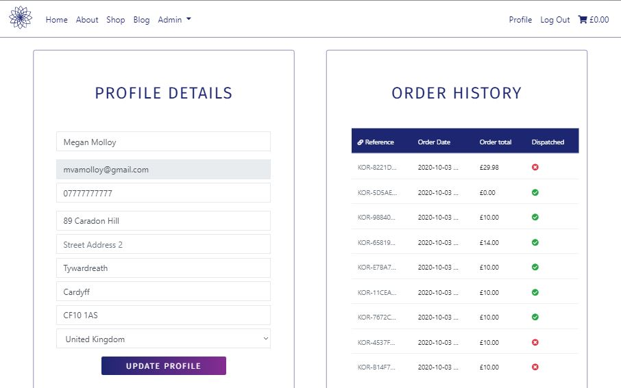

# KOR CBD e-Commerce Store


The KOR CBD e-Commerce store is for a company which sells CBD products to athletes, and is particularly targeted towards martial artists. It is designed to 
allow users to shop and checkout either anonymously or as a logged in user using Stripe's Payment appearing. Extra features are available to logged in users, such as persiting their user
profile information, a saved order history, and the ability to interact with blog posts. The whole app is written in Python using the Django framework. 

The django app is deployed using Amazon Web Services and Heroku and is availabe here: <deployed_link>

## Contents
1. [Client](#client)
    - [Client Information](#client-information)
2. [UX](#ux)
    - [Users](#users)
    - [User Goals](#user-goals)
    - [Wireframes](#wireframes)
    - [Colour Palette](#colour-palette)
3. [Features](#features)
     - [Navigation](#navigation)
     - [Home](#home)
     - [Allauth](#allauth)
     - [About](#about)
     - [Products](#products)
     - [Cart](#cart)
     - [Checkout](#checkout)
     - [Profiles](#profiles)
     - [Blog](#blog)
     - [404](#404)
     - [Toasts](#toasts)
     - [Future Features](#future-features)
4. [Information Architecture](#information-architecture)
    - [Database](#database)
    - [Data Models](#data-models)
5. [Technologies Used](#technologies-used)
    - [Frameworks](#frameworks)
    - [Template Engines](#template-engines)
    - [Databases](#databases)
    - [Backend Libraries](#backend-libraries)
    - [Frontend Libraries](#frontend-libraries)
    - [Languages](#languages)
    - [Development Tools](#development-tools)
6. [Testing](#testing)
7. [Deployment](#deployment)
    - [Requirements](#requirements)
    - [Git Instructions](#git-instructions)
    - [Heroku Instructions](#heroku-instructions)
8. [Credits](#credits)
    - [Content and Code](#content-and-code)
    - [Media](#media)
    - [Acknowledgements](#acknowledgements)


## Client Information

The goals that KOR CBD have given for this e-Commerce store are: 

- Present a clinical and reputable brand aesthetic without appearing bland. 
- Target the website to martial artists, without using jargon that excludes athletes from other sports. 
- Have a smooth payment flow for customers from the moment a project is added to the cart.
- Provide a record of all orders placed so that they can be fulfilled. 
- Provide customers with extra information about the company through an about page and a blog. 
- Restrict certain activities to KORCBD staff such as CRUD functionality for products and blog posts.
- Link the store to the companies social media accounts to bootst customer interaction. 

## UX

### Users

Users of the KOR CBD website are most likely looking to buy CBD products. While the company targets itself at martial artists, many of their customers are athletes in other sports. The website needs to still be accessible to them. 

## User Goals 

- As a customers I want to be able to:
    - Easily navigate the store using a layout that is consitent across all pages. 
    - Find out a bit about the business and its products before I commit to buying them. 
    - Search for specific products and content that I am interested in.
    - Filter products by categories so I don't waste time looking at products I'm not interested in.  
    - Check that the products don't contain any ingredients that I am allergic to. 
    - Add items to my cart and checkout anonymously if I decide not to sign up to the site. 
    - Recieve a confirmation of my order so that I know it has been placed. 
    - Have a unique order number for my order so that it can be easily located by the company. 
    - Sign up to the site if I decide I would like to order more often. 
    - Save my billing and shipping details so I don't have to fill them out every time I make an order. 
    - Update my profile details as and when they change. 
    - View my order history and the details of each order. 
    - Read blog posts about the company and interact with them. 
    - Be able to contact the company if I have any questions or complaints. 
    - Be able to connect with the business on social media. 

## Wireframes 

## Colour Palette

# Features 

## Navigation 

### Nav Bar 


- Occupies the full width at the top of every page. 
- Sticks to the top of viewport so it is always visible page content appears to scroll beneath it. 
- On the left is the company logo without the brand text. On hovering over the logo, it turns to the pink version of it. The logo acts as a link back to the home page. 
- On large screens, links to the Home, Shop, About and blog Blog pages are shown. 
- Also shown are links to log in, sign up, and log out depending on the status of the user. 
- A cart logo is displayed next to the user's current order total. Clicking on the icon or total takes the user to view their cart.
- An Admin dropdown link is shown for users who are authorised as staff.
- On hovering over links, they turn pink to indicate to the user they can click it.
- On smaller screens, these links are shown in a dropdown nav that is opened via the toggler icon.


### Footer


- Occupies the full width at the base of every page. 
- Contains links to companies social media sites and to a modal containing contact info.
- The company name acts as a link back to the home page. 
- Maintains the same structure and order on all screen sizes. 

## Home

### Jumbotron Carousel


- The carousel at the top of the home page displays 3 images which are all of martial artists.
- Three dark-ish images were chosen to contrast with the light colour scheme of the site.
- The carousel occupies the whole width of the viewport. 

### Intro Text 


- The text below the carousel dispalys the companies logo, name and tag line. 
- Below this, a banner displays words related to the company which automatically fade in. The JavaScript used to make this text animated can be found inside the extrajs block at the bottom of the index.html template. 

### Icon Links 


- Icons with CTA buttons beneath them link users to the four main parts of the site: About, Products, Blog, Profile, 
- On large screens, these icons display side-by-side in a row. On smaller screens they are stacked with two in the first row, and two in the second.

### Product Category Cards


- Six cards link to the products section with each of the six product categories included as queries in the url. 
- A hero image for a product from each category is included in the card, along with the category name. 
- The whole card acts as an anchor element so that users can click anywhere on it to go to the category page. This is useful on mobile devices where clicking on the small text link proved a matter of ninja-like accuracy.
- A CTA button takes users to view all the products in the store. 

### Recent Blog Posts 


- The three most recent blog posts are passed to the home view and rendered out in this section. They are displayed side-by-side on larger screens, and one on top of the other on mobile screens.
- The post image, title, author, date and a snippet of the post body are displayed. A CTA button in each card links the user to the blog post.
- A CTA button takes users to view all the blog posts. 

## Allauth


- The templates provided by Allauth are used for the Log In, Sign Up and Log Out pages.
- These templates also provide other templates used for user admin such as email verification, updating email addresses and passwords. 
- All Allauth templates have been edited to match the rest of the site colour theme and layout.

## About


- The about page contains the company logo and about title.
- The about content is contained in a single card. 
- Currently this content is split into three paragraphs, written by the client. 

## Products 

### All Products 


- The prodcuts page displays all products in the store. These products can then be sorted by price (ascending and descending) or filtered by category and seach query.
- Under the nav bar, the current products being viewed is displayed, along with the number of products included in the products queryset. Any search terms of category filters are also shown here as breadcrumbs. 
- Clicking the all prodcuts link in this banner removes and filters and returns the user to viewing all products in the store. 
- Each product card displays the product image, name and price. The image acts as a link to the product's detail page. A button on each card also links to the product details page. 


- On mobile screens, products are stacked on top of each other making it easy for the user to scroll through them.
- The price ordering and category filtering buttons are removed. Users can easily locate products they are interested in using the search bar. 

### Product detail


- The product detail page displays the product title, image, price, description and ingredients. 
- A link under the product title links the user to view all products in the same category as the product being viewed.
- A quantity input allows users to enter the quantity they would like to buy either by using the adder and subtractor buttons, or by typing in the number manually. 
- An add to cart button adds the specified quantity of the item to the users card. A toast success message displays the new cart contents to the user, with a link to checkout at the bottom of the toast.
- A button at the bottom of the product detail card links the user back to view all products in the store.


- On mobile screens, the product detail page is very similar. Instead of being displayed in two columns side-by-side, the page elements are stacked on top of each other.

## Cart

## Checkout

## Profiles 



- The products page allows a user to view and update their profile information and view their order history.
- On large screens these cards are side-by side. On smaller screens, the profile details card sits on top of the order history card.
- The user profile details here link to the profile model. These are the details used to pre-populate the checkout form. 
- The email field is displayed to the user but is disabled, as the email is the linked to the Allauth user model rather than the profile model. 
- The user profile details are also updated when the fields are edited at checkout and the user opts to save it via checkbox.  
- The order history contains a table with an overview of all orders placed on the user's account. This includes the order reference, the date orderd, the order total and an icon indicating if the item has been dispatched or not (a boolean toggled by admin staff in Django Administration).
- The order references in the table act as links to the confirmation page for that order, so that the user can review all of its details. 
- If the number of orders exceeds the height of the order history container, a y-scroll bar allows the user to scroll down to see older orders. 

## Blog


# Information Architecture

## Database

The app was developed using the local [sqlite]() database that is installed with django. For the deployed version of the app, a [PostgreSQL]() database is used that is provided by [Heroku](). 

## Database Models 

### User

The User model is provided by the ```django.contrib.auth.models``` import.

### Products

The ```Product``` model in the ```Products``` app contains data on each product in the store.

| Name | Key in db | Validation | Field Type |
--- | --- | --- | ---
Name | name | max_length=100 | CharField
Sku | sku | max_length=254 | CharField
Category | category | | ForeignKey
Image_URL | image_url |  | URLField
Description | description |  | TextField
Ingredients | ingredients |  | TextField
Price | price | max_digits=6, decimal_places=2 | DecimalField

### Orders 

The ```Order``` model ```OrderLineItem``` model  in the ```Cart``` app contains data on each order that is made.

#### Order Model

| Name | Key in db | Validation | Field Type |
--- | --- | --- | ---
Order Reference | order_reference | max_length=32 | CharField
User Profile | user_profile | | ForeignKey
Full Name | full_name | max_length=100 | CharField
Email | email | max_length=254 | EmailField
Phone Number | phone_number |  max_length=20 | TextField
Country | country |  | CountryField
Post Code | postcode | max_length=20 | CharField
Town or City | town_or_city | max_length=40| CharField
County| County | max_length=40| CharField
Street Address 1 | street_address1 | max_length=80 | CharField
Street Address 2 | street_address2 | max_length=80 | CharField
Date | date | auto_now_add=True | DateTimeField
Order Total | order_total | max_digits=10, decimal_places=2 | DecimalField
Paid | paid | | BooleanField
Dispatched | dispatched | | BooleanField
Original Cart | original_cart | | TextField
Stripe PID | stripe_pid | max_length=254 |TextField

#### Order Line Item Model 

| Name | Key in db | Validation | Field Type |
--- | --- | --- | ---
Order | order | | ForeignKey
Product | product | | ForeignKey
Quantity | quantity | | IntgerField
Line Item Price Per Unit | lineitem_price_per_unit | max_digits=6 | DecimalField
Line Item Total | lineitem_total |  max_length=20 | DecimalField

### Profiles 

The ```Profile``` in the ```Profiles``` app contains data on user profiles.

| Name | Key in db | Validation | Field Type |
--- | --- | --- | ---
User | user | | OneToOneField
Profile Phone Number | profile_phone_number |  max_length=20 | TextField
Profile Country | profile_country |  | CountryField
Post Code | profile_postcode | max_length=20 | CharField
Town or City | profile_town_or_city | max_length=40| CharField
County| County | max_length=40| CharField
Street Address 1 | profile_street_address1 | max_length=80 | CharField
Street Address 2 | profile_street_address2 | max_length=80 | CharField

### Blog

The ```Post``` model and ```Comment``` in the ```Blog``` app contains data on blog posts and user comments on them.

#### Post 

| Name | Key in db | Validation | Field Type |
--- | --- | --- | ---
Title | user | max_length=255 | CharField
Author | author |  | ForeignKey
Body | body |  | TextField
Date | date | auto_now_add=True | DateField
Image Url | image_url | max_length=40 | CharField
Tag 1 | tag_1 | max_length=20| CharField
Tag 2 | tag_2 | max_length=20 | CharField
Tag 3 | tag_3 | max_length=20 | CharField
Hearts | hearts | | ManyToManyField

#### Comment

| Name | Key in db | Validation | Field Type |
--- | --- | --- | ---
Post To Comment | post_to_comment | | ForeignKey
Author | author |  | ForeignKey
Comment Body | body |  | TextField
Date | date | auto_now_add=True | DateField


## Technologies Used
### Frameworks 
- [Django]() used as a python framework to develop the track app. Not only does this act as the microserver for the app.
### Template Engines 
- [Django Template Engine]() to display data from the backend of the app and apply conditions to the HTML code. 
### Databases 
- [sqlite]()
- [PostgreSQL]() to provide the database which backs this app. 
### APIs
- [Stripe]() 
### Backend Packages
- [Travis](https://pymongo.readthedocs.io/en/stable/) to allow the Python app to communicate with MongoDB. 
- [Coverage](https://flask-pymongo.readthedocs.io/en/latest/) to bridge between Flask and PyMongo and simplify writing CRUD functions for MongoDB in Python. 
### Frontend Libraries
- [jQuery](https://jquery.com/) to make the app's elements interactive and provide DOM manipulation. 
- [Bootstrap 4]() to provide the JavaScript charts for the view goal page. 
- [FontAwesome]()
- [Google Fonts]()
### Languages
- [HTML5](https://developer.mozilla.org/en-US/docs/Web/Guide/HTML/HTML5) to create the app elements. 
- [CSS3](https://developer.mozilla.org/en-US/docs/Web/CSS) to style the app elements. 
- [JavaScript](https://developer.mozilla.org/en-US/docs/Web/JavaScript), paired with [jQuery](https://jquery.com/), to make the app interactive.
- [Python](https://docs.python.org/3/) to work with the Flask web framework. 
### Development Tools
- [GitHub](http://github.com/) and [Gitpod](https://gitpod.io/) to develop the app's code and provide version control. 
- [Heroku](https://www.heroku.com/) to deploy the app via Heroku's cloud platform. 
### Testing Tools
For information about the testing of this app and the testing tools used, see the separate [testing.md](TESTING.md) file. 
### Content
- [Unsplash](https://unsplash.com/) to provide the image URLs used in the carousel on the index page.
- [Smart Mockups](https://smartmockups.com/) to create the app mockups used in this readme. 


